# **Monitoring Operations with Amazon OpenSearch**

This lab is provided as part of **[AWS Innovate Data Edition](https://aws.amazon.com/events/aws-innovate/data/)**,  it has been simplified from an [AWS Workshop](https://github.com/aws-samples/amazon-OpenSearch-intro-workshop)

Click [here](https://github.com/phonghuule/aws-innovate-data-edition-2022) to explore the full list of hands-on labs.

ℹ️ You will run this lab in your own AWS account. Please follow directions at the end of the lab to remove resources to avoid future costs.

## Background

In this lab, you will understand how to use Amazon OpenSearch by actually building a real-time dashboard and performing a full-text search using Amazon OpenSearch and related AWS services. The goals of this lab is to provide you a basic knowledge of Amazon OpenSearch for future use.

The architecture of the system that you will configure in this Lab is as follows.

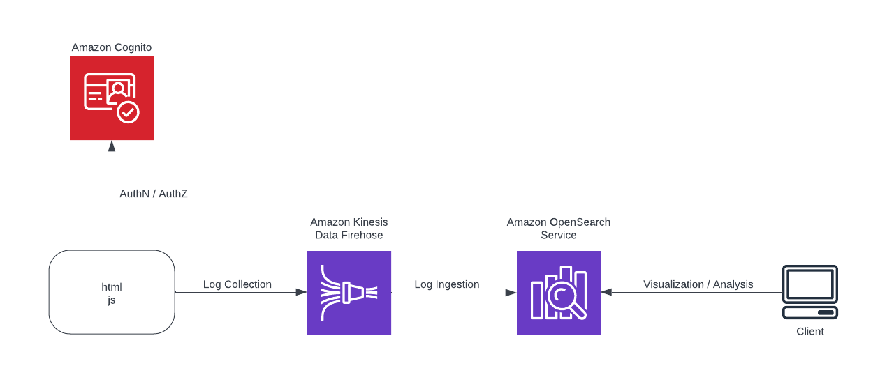

This system uses a JavaScript based tool called Kinesis Data Generator to generate logs for analysis. This tool performs authentication and authorization for sending logs using a service called Amazon Cognito. Then, Kinesis Data Generator sends logs with the designated format to a log aggregation service called Amazon Kinesis Firehose (hereafter, Firehose). Logs sent to Firehose are written in Amazon OpenSearch Service (hereafter, Amazon OS) after collecting data with designated intervals. Amazon OS bundles browser-based visualization and analysis software called OpenSearch Dashboards. Using this OpenSearch Dashboards, you will perform visualization and aggregation of logs from the browser.

## Section 1: Creating an Amazon OS Domain

In this section, you will create an Amazon OS domain. In Amazon OS, OpenSearch clusters are called domains. When the process of domain creation is performed, a new virtual machine starts up in the backend, and then the setup for OpenSearch cluster will start.

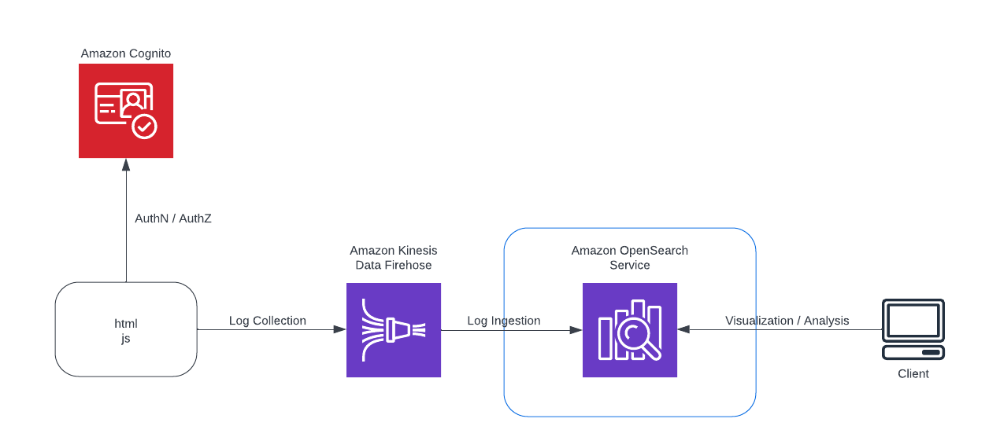

### Creating an Amazon OS Domain

1. Log in to the [AWS Management Console](https://us-east-1.console.aws.amazon.com/esv3/home?region=us-east-1#opensearch), confirm that **[N. Virginia]** is chosen by the region selector in the right of the header in the console screen. 
1. Click **[Create domain]** button to proceed to the domain creation. 
1. In **"Configure domain"**, enter **"workshop-osdomain"** in **"OpenSearch domain name"**. 
1. In **"Choose deployment type"**, choose **["Development and testing"]** in **"Deployment type"**. 
1. In **"Data nodes"**, choose **t3.medium.search** as **"Instance type"**. 
  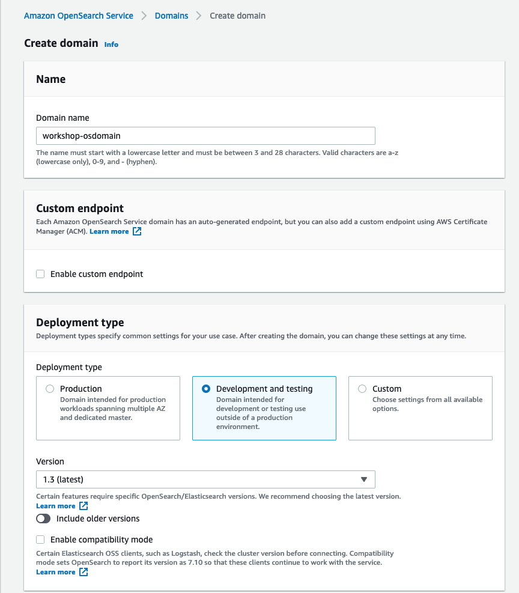
  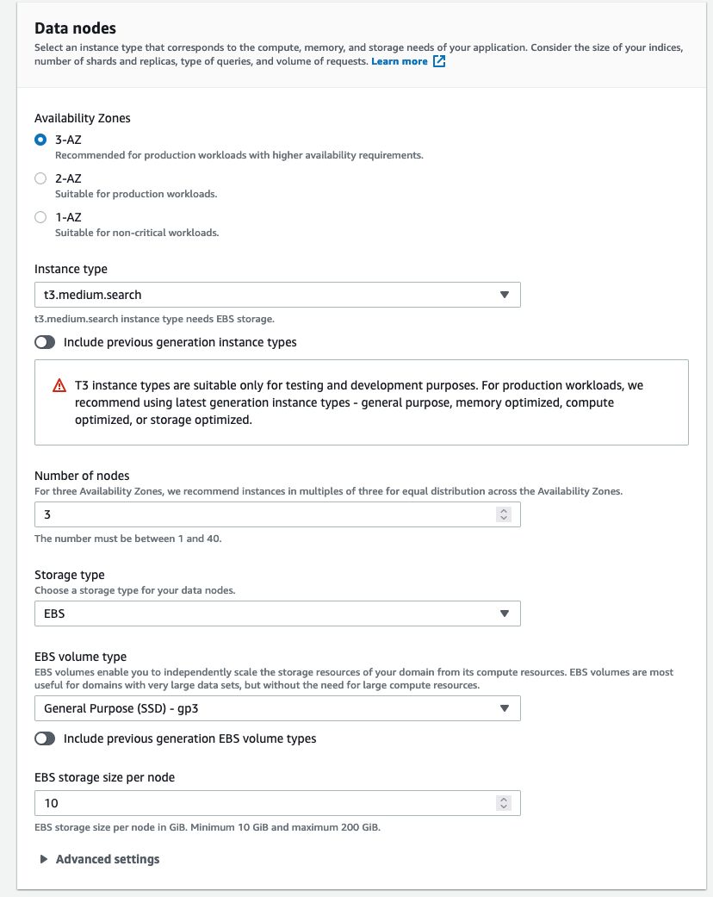
1. In **"Network"**, choose **Public Access** 
1. In **"Fine-grained access control"**, enable **Enable fine-grained access control** and choose **[Create master user]** in **"Fine–grained access control"**. The master user account you will created here is used to log in to the visualization tool OpenSearch Dashboards on Amazon OS. Enter any **master user name** and **master password**. The user name and password you set here will be used in Section 3.
  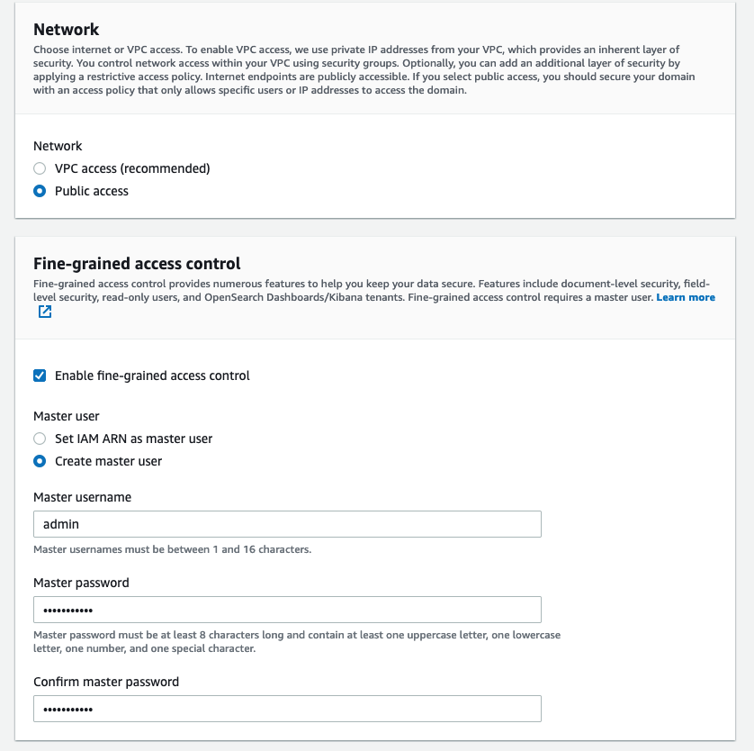
1. Next, set an access policy. Click [here](https://whatismyipaddress.com/) to confirm your IP address. Then, choose **[Configure domain level access policy]** in **Domain access policy**, and choose **[IPv4 address]** in the item below. In the blank to the right, enter your IP address that you have confirmed in the above, and choose **[Allow]** on the right item. Click **[Next]** at the bottom of the screen after setting up to here.
   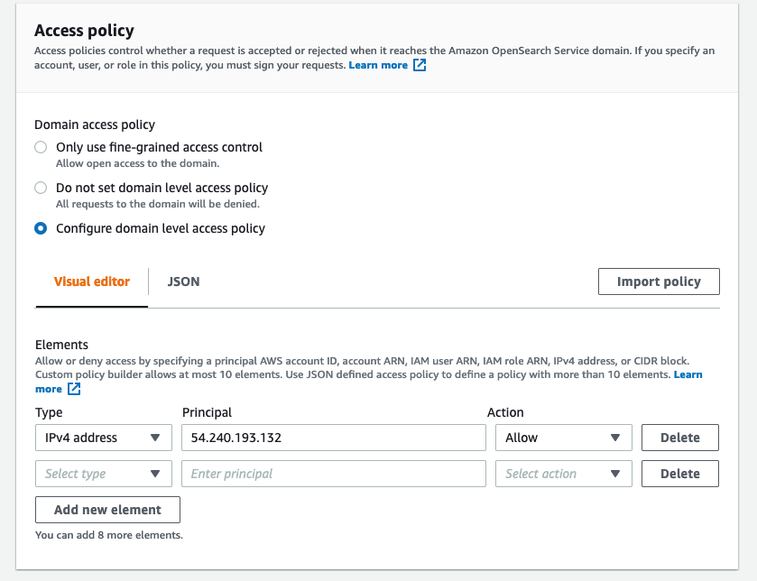
1. In **"Add tags - optional"**, add tags if necessary
1. Review the settings you have made in the above, and if there is no concern to them, click **[Create]** at the bottom right of the screen to create the domain. It takes approximately 15 minutes to create the domain. Meanwhile, move onto a Firehose stream creation in Section 2.


## Section 2: Creating a Firehose Stream

In this section, you will create a Firehose stream that you can use to insert logs into Amazon OS.

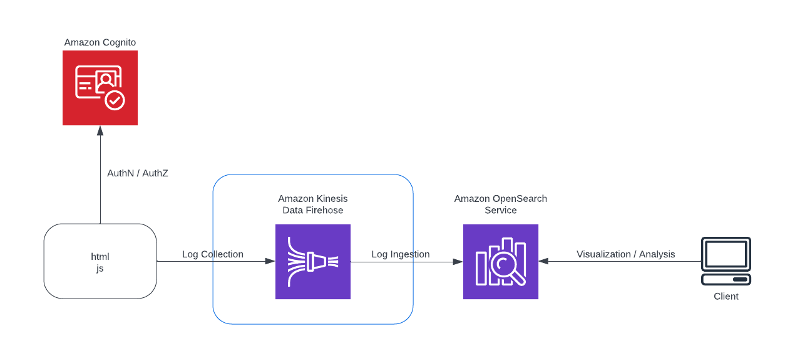

### Creating a Firehose Stream

1. Go to [Kinesis Data Firehose Console](https://us-east-1.console.aws.amazon.com/firehose/home?region=us-east-1#) in **[N. Virginia]** 
1. Click **[Create a delivery stream]** to go to the Firehose stream creation page.
  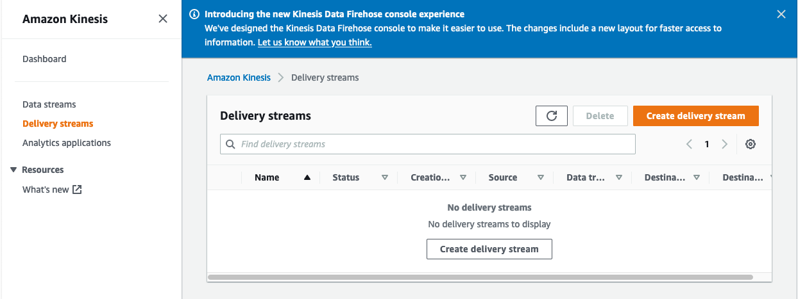
1. Select **Direct PUT** as Source and **Amazon OpenSearch Service** as Destination
   Enter **workshop-firehose** in "Delivery stream name". 
   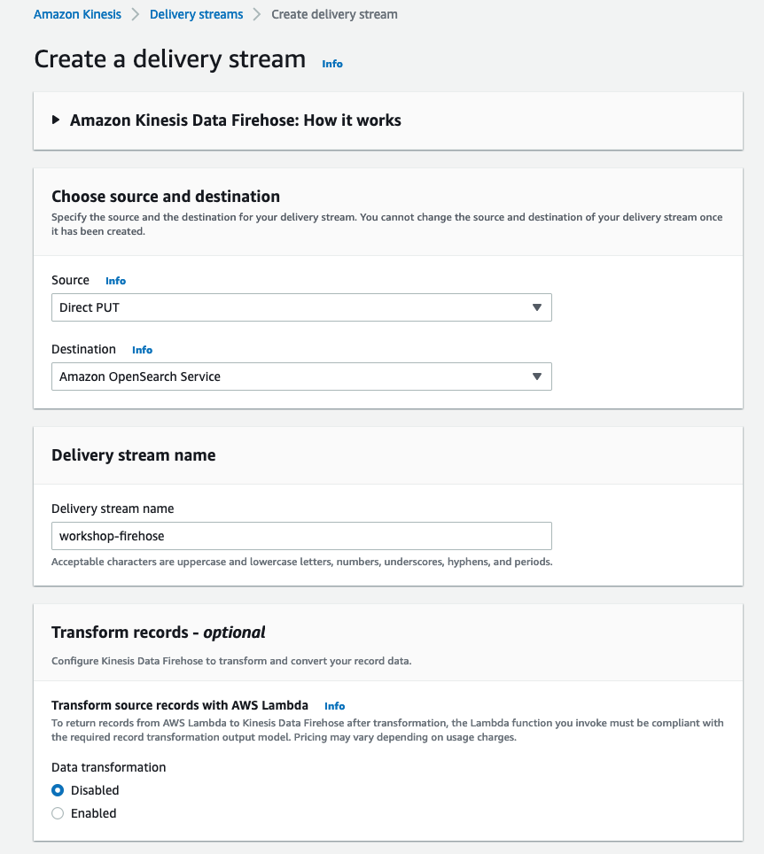
1. In **Destination settings**, click **Browse** and select **["workshop-osdomain"]** you have created in Section 1. You can now automatically send logs into Amazon OS above. If Domain is in Processing status, wait until it is selectable.
   
1. Enter **"workshop-log"** in **"Index"**. Amazon OS Index is equivalent to a table in DB in a simple analogy, but the log sent from this Firehose stream will be inserted into the index called workshop-log. If there is no Index on the Amazon OS in inserting, an Index is automatically created.
1. Choose **[Every hour]** from the pull-down menu in **“Index rotation”**. With this setting, a new index is created every hour. 
1. In **"S3 backup"** below, click **[Create new]** button on the right of **"Back up S3 bucket"** to go to Create S3 bucket. In **"S3 bucket name"**, enter **"workshop-firehose-backup-YYYMMDD-YOURNAME"** (Replace YYYMMDD with today's date, for example, 20220821. And then, replace YOURNAME with your name). This bucket is used to store a backup of records that fail when inserting them from Firehose into Amazon OS.
  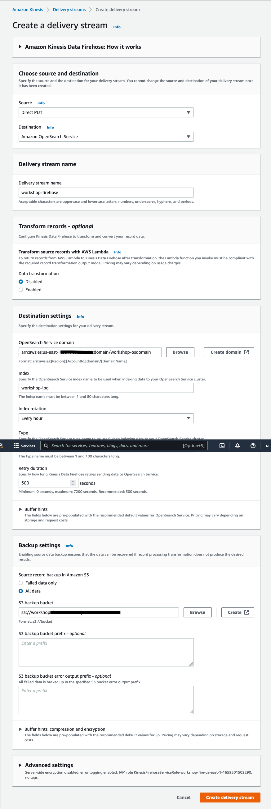
1. Review the settings you have entered in the above, and if there is no concern to them, click **[Create delivery stream]**. It takes a few minutes to create the stream.

## Section 3: Setting Amazon OS Permissions

You have created the Amazon OS domain and the Firehose stream to insert logs into it. However, Firehose cannot send logs to Amazon OS because you have not set the appropriate permissions yet. In this section, you will use OpenSearch Dashboard which is a web interface on Amazon OS to give Firehose permission to insert logs.

### Creating an Amazon OS Role

1. Go to **[Amazon OS]** from [Service] in the top left of the AWS Management Console.
1. Click **[workshop-osdomain]** you have created in the above on the Amazon OS dashboard.　When the domain details are displayed, click on the **"OpenSearch Dashboard"**.　The login screen for OpenSearch Dashboard is displayed, so that enter the master user and the master password specified in the Section 1.
1. Choose **[Explore on my own]** after logging in. Then, choose **[Private]** and click **[Confirm]** on **[Select your tenant]** screen.
1. Then, click  icon on the left side of the screen and choose **[Security]** menu.
1. Click **[Create new Role]**  on **[Get started]** screen.
  
1. Enter **"workshop_firehose_delivery_role"** in **"Name"**.
   
1. Add **"cluster_composite_ops"** and **"cluster_monitor"** to **[Cluster permissions]**. These permissions are used to read cluster information, and are predefined in Open Distro. For more information, please click [here](https://opendistro.github.io/for-OpenSearch-docs/docs/security/access-control/default-action-groups/#cluster-level).
1. Enter **"workshop-log-*"** including the index name designated in Firehose earlier in **"Index"** in **[Index permissions]** section. The real index name will be created with a date in the end of the name like "workshop-log-2020-04-01-09", therefore all those should be included. Then, add  **"create_index"**, **"manage"**, **"crud"** to **"Index permissions"**.
   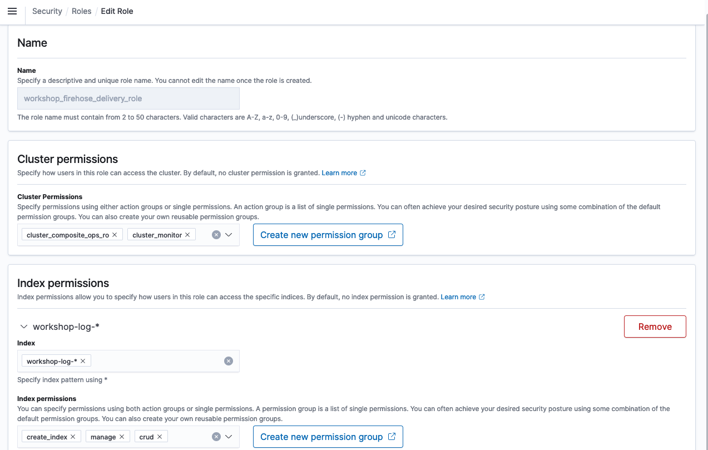
1. Click **[Create]** button at the bottom of the screen to create the role.

### Mapping Roles with IAM Roles

1. Go to **[Kinesis](https://console.aws.amazon.com/kinesis/home?region=us-east-1#/dashboard)** page from [Services] on the top left of the AWS Management Console.　Open **"Delivery Stream"** on the left side menu, choose **[workshop-firehose]** you have created in this Lab.　On the stream details screen, click the link **[KinesisFirehoseServiceRole-XXX...]** displayed in **"IAM role"**.
1. In the IAM management console, click **"arn:aws:iam::123456789012:role/KinesisFirehoseServiceRole-XXX..."** to the right of **"Role ARN"**. (this value is different individually, so that make sure it on the screen and then copy it) This is the IAM role that manages permissions to AWS resources for Firehose.
1. Go back to the management screen for OpenSearch Dashboard. Next, click  icon on the left side of the screen and choose **[Security]** menu. Then, choose **[Roles]** from the left side menu to go to the role list screen.
1. Choose **"workshop_firehose_delivery_role"** from **"Roles"**.
1. Open **[Mapped users]** tab, and click **[Manage mapping]** button.
   
1. Paste the string of Role ARN you have copied in the above, and click **[Map]** button.
   

## Section 4: Setting Up Kinesis Data Generator

In this section, set up the Kinesis Data Generator. Kinesis Data Generator is a web application developed and provided as a service by AWS to generate logs flowing into Kinesis. To learn more about this service, please read [this article](https://aws.amazon.com/blogs/big-data/test-your-streaming-data-solution-with-the-new-amazon-kinesis-data-generator/ ).

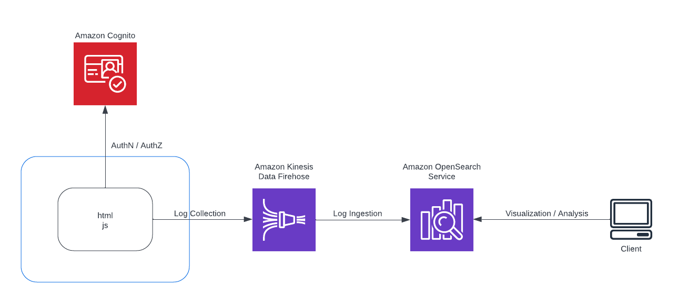

### Creating Required Resources with CloudFormation

1. Click [here](https://console.aws.amazon.com/cloudformation/home?region=us-west-2#/stacks/new?stackName=Kinesis-Data-Generator-Cognito-User&templateURL=https://aws-kdg-tools.s3.us-west-2.amazonaws.com/cognito-setup.json) to start with the CloudFormation stack creation screen. Kinesis Data Generator uses a service called Amazon Cognito at the backend for login authentication and authorization of log sending permissions. By creating this CloudFormation stack, you can create the necessary Cognito resources.
1. In **"Step 1: Specify template"**, make sure that the Amazon S3 URL where the template source is located has already entered. This CloudFormation stack creation is only available in the Oregon region. Therefore, the region selection in the top right of the screen is set to **[Oregon]**, so click **[Next]** without any changes.
1. In **"Step 2: Specify stack details"**, enter the appropriate value for **"Username"** and **"Password"** for **"Kinesis Data Generator"**. The username and password specified here will be used to log in to Kinesis Data Gnerator later. Once you have entered, click **[Next]**.
1. In **"Step 3: Configure stack options"**, click **[Next]** without any changes.
1. In **"Step 4: Review"**, check the check-box of **"I acknowledge that AWS CloudFormation might create IAM resources with custom names "** at to bottom of the screen, and then click **[Create stack]** button to start the stack creation.
1. Wait for a few minutes until the stack status changes  CREATE_COMPLETE.

### Sending Logs from Kinesis Data Generator

1. Choose **[Output]** tab of the CloudFormation stack you have created. You can open the setting screen of Kinesis Data Generator by clicking the URL of **"KinesisDataGeneratorUrl"** displayed.

1. Enter the user name and password you have created in the the above step to **"Username"** and **"Password"** in the top right of the screen, and then login to it.

1. Configure the log transfer setting actually in this step. In **"Region"**, choose **[-east-1]** ( N. Virginia region), and then choose **[workshop-firehose]** you have created earlier in **Stream/delivery stream**.

1. Enter **"5"** to **Records per second** (the number of log records generated per second). This means that 5 records are created per 1 second. As a result 300 records are generated in one minute, and then sent to Firehose.

1. In **"Record template"** below, copy and paste the following codes into **Templete 1** field. This specifies the format for logging sent from IoT sensors. It automatically generates dummy log data using such as random numbers.

   ```json
   {
       "sensorId": {{random.number(50)}},
       "currentTemperature": {{random.number(
           {
               "min":10,
               "max":150
           }
       )}},
       "ipaddress": "{{internet.ip}}",
       "status": "{{random.weightedArrayElement({
           "weights": [0.90,0.02,0.08],
           "data": ["OK","FAIL","WARN"]
       })}}",
       "timestamp": "{{date.utc("YYYY/MM/DD HH:mm:ss")}}"
   }
   ```

1. When clicking [Test template] at the bottom of the screen, you can check the sample of the log being actually sent. You can see that five records are generated as follows:

   ```json
   {    "sensorId": 42,    "currentTemperature": 38,    "ipaddress": "29.233.125.31",    "status": "OK",    "timestamp": "2020/03/03 12:49:12"}
   ```

1. Click **[Send data]** button at last to start sending the log. The Data continues to be sent to Firehose until you click [Stop Sending Data to Kinesis] displayed in the pop-up menu or close the browser tab.

## Section 5: Visualization and Analytics in OpenSearch Dashboards
### Overview of OpenSearch Dashboards

From this section, you basically use OpenSearch Dashboards to perform the analysis. OpenSearch Dashboards is a web application that allows you to visualize and analyze stream data using OpenSearch as backend. The following diagram shows the main analysis screen for OpenSearch Dashboards.

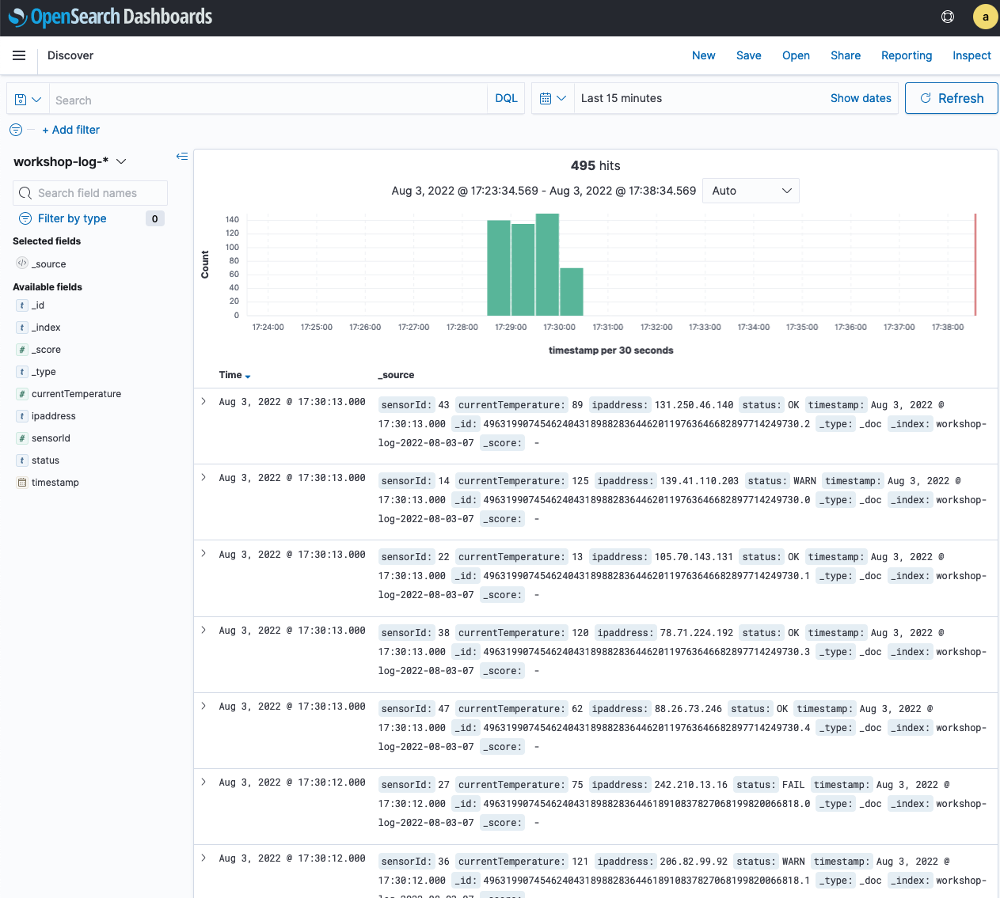

The icon on the left of the screen is the menu button. The content of each menu are described in order from the top in the list below.

**OpenSearch Dashboards**
- **Overview**: This screen is a landing page for Dashboard, Discover and instructions to add data.
- **Discover**: This screen filters the data accumulated in OpenSearch by a search query and displays a graph of the results. You must first create a dataset for searching, called index pattern.
- **Dashboards**: This screen let you create a dashboard by arranging multiple graphs created in Visualize.
- **Visualize**: This screen let you create a chart component from a dataset.

**OpenSearch Plugins**
- **Query Workbench**: This screen let you search documents with SQL and PPL.
- **Notebooks**: This screen let you create OpenSearch Dashboards Notebook. OpenSearch Dashboards Notebook offers to create an interactive report.
- **Alerting**: This screen let you configure to send alerts when the data stored in OpenSearch meet a predifined criteria.
- **Anomaly Detection**: This screen let you manage detector.
- **Trace Analytics**: This screen let you manage dashboards, traces and services generated by Open Telemetry. 
- **Index Management**: This screen let you manage indexes stored in OpenSearch.
- **Security**: This security management screen let you manage the permission management of users and data.

**Management**
- **Dev Tools**: This development screen allows OpenSearch to perform operations directly by calling the API.
- **Stack Management**: This screen allows you to manage the index pattern which is a dataset for analysis and also let you configure advanced settings for OpenSearch Dashboards.

The main features in the above will be covered in this hands-on. First, after talking about an index, which is a basic collection of data in OpenSearch, then let’s create an index pattern to be the dataset in analyzing it with OpenSearch Dashboards.

### Creating an Index pattern

Now, you will create an index pattern to read the index created in Lab 1.

1. Click  icon icon on the left side of the screen, open **"Dashboard"** menu, and choose **[Index Patterns]** in the left. Then, click **[Create an index pattern]** link at the bottom.
   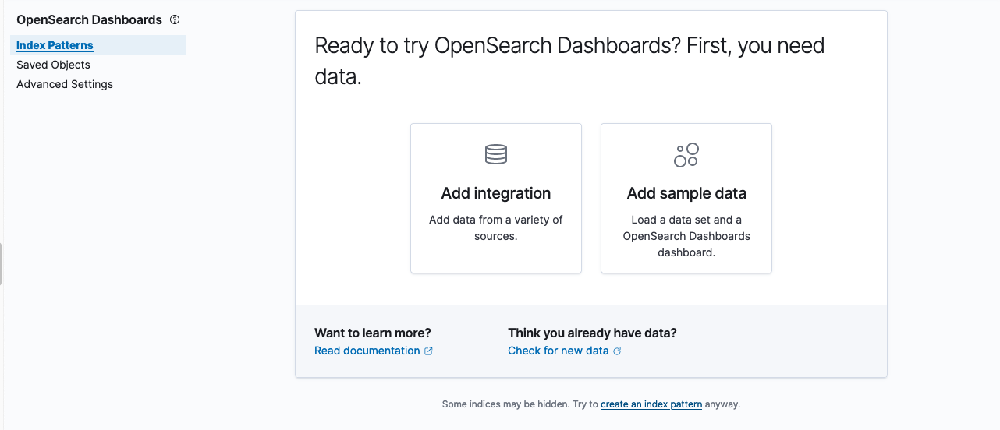
1. Enter **"workshop-log-\*"** to **"index pattern"** in **"Step 1 of 2: Define index pattern"**, click **[> Next step]** button. The last \* is called a wild card to use for matching multiple indexes. 
1. In **"Step 2 of 2: Configure settings"**, choose **[timestamp]** from the pull-down menu of **"Time Filter field name"**. In OpenSearch Dashboards, it is a very common use case to visualize data flowing in a stream chronologically. You are specifying the key to aggregate chronological date here. The field named "timestamp" contained in the log format specified in the Kinesis Data Generator is recognized automatically as date type by OpenSearch.
1. Click **[Create index pattern]** button to create a new index pattern.

Your preperation has been completed. Now let's take a look at the data.

### Data Visualization with Discover
In this section, you will explore the data of the Index pattern you have created earlier. Discover is a tool for viewing data in OpenSearch Dashboards, so let's try to use it here. The screen description of Discover is as follows.
  
1. Click  icon icon on the left side of the screen, and open **[Discover]**.
1. Choose **[workshop-log-*]** from the pull-down menu in the Index pattern on the left of the screen, a bar chart is displayed. Make sure that the Document is lined up in below. In addition, click the calendar button in the top right of the screen to specify the time to search, and click **[Today]** in **"Commonly used"**. It displays all of the logs for the day. You can change the display and search scope by changing the values here.
1. At the content of Document, you can see that the fields such as sensorId, currentTemperature, Ipaddress. starus, and timestamp, same as the template to specified in Lab1 are also displayed here. Meanwhile, some fields are not specified, such as _id, _type, _index, and _score. These are the metadata that OpenSearch adds automatically.
   
1. Enter `status:WARN` in the search field at the top left of the screen, and click **[Update]** button in the right. This input works as a filter criterion so that only Document displayed on the screen is in the WARN status, and the WARN is highlighted. Also, Document for FAIL or WARN is displayed by entering `status:FAIL|WARN`.
1. Try to do **[Update]** by entering `currentTemperature>100`. You can filter records only with a temperature of 100 degrees or higher. Also, you can combine multiple conditions. By filtering such as `currentTemperature>100 and status:WARN`, you can search records only with a temperature of 100 degrees or higher and WARN. You can also search by combining OR conditions such as `(currentTemperature > 120 and status:WARN) or sensorId: 10`. Then, you can filter records only with the IP address starting with 1 by using `ipaddress:1*`. Please try various search criteria.
1. Click **[status]** in the Field list on the left in this state. For each WARN, OK, and FAIL including this Field, the ratio of each item in the search result will be displayed. Note, however, that this value is an approximate value, not a whole quantity.

### Creating Graphs with Visualize

Now, you will try creating a graph here. OpenSearch Dashboards has a graphing and drawing tool called Visualize. However, to use the Visualize feature, you need to understand OpenSearch terminology. The idea of graphing will be explained using several graph drawings here. The below shows you the description of Visualize screen.


First, we will create a pie chart to visualize a ratio of OK, WARN and FAIL status of all records.

1. Click  icon on the left side of the screen, and open **[Visualize]**. Next, click **[+ Create new visualization]** button to go to the graph creation screen. Select **[Pie]** from the pop-up menu. Then, move to the data source selection screen, and open the graph creation screen by choosing **[workshop-log-*]**.
1. In the menu on the right of the screen, confirm **"Metrics"**. You can see **"Count"** displayed in **[Slice size ]** here. This indicates that the aggregation target of the graph is the number of records. You can change the aggregation target by clicking **[Slice size]** to display the details menu. There is no need to do anything because the number of records is as it is.
1. Move onto **"Buckets"** and click **[+ Add]** button. There are two menus here. Choose **[Split Slices]**. This adds an axis to aggregate values on a single chart. Note that if you choose **[Split Chart]**, you will create the same numbers of the graphs as the number of categories of metrics you selected. The graph that has as much as categories of metrics you have chosen will be created.
1. Let's look at the steps to add the status to the axis to aggregate value here. Choose **[Terms]** in **"Aggregation"**. We typically use this Terms to add an axis for the category type field such as status. Then, add **[status.keyword]** in **"Field"**.
1. Once you could set this up, click **[▷ Update]** button on the right side of the screen to reflect the changes. The following graph will be displayed. When you hover your cursor over the graph, the ratio of each item will be displayed. The chart can be adjusted in details from **[Options]** tab at the top of the right menu.
   ]
1. At last, give the graph a name and save it. Click **[Save]** button in the top right of the screen, give a name **"Percentage of Status"** for **"Title"**, and click **[Save]**. After completed saving, click the **[Visualize]** link in the top left of the screen, and go back to the top page of Visualize menu. Now, you can see that the graph you have created is displayed in the list.


Now, let’s create a chronological graph. By dividing data into multiple groups by sensor temperature, let's visualize the number of abnormal records.

1. Click  icon on the left side of the screen, and open **[Visualize]**. Next, click **[ + Create new visualization]** button to go to the graph creation screen. From the pop-up menu, choose **[Area]**. Then, move to the data source selection screen to open the graph creation screen by choosing **[workshop-log-*]**.
   ]
1. Enter `status:WARN|FAIL` in the search window at the top left of the screen. Next, click a calendar icon at the right side of the search window. Then set date range to **[1]** **[Hours ago]**, and click **[Apply]** button. This allows you to change the time zone displayed on the screen. 
   Then, Click **[▷ Update]** button on the right side of the screen to reflect the changes. Now you can perform the aggregation that is filtered to records with abnormal status.
1. Click **[+ Add]** button and choose **[X-Axis]** in **"Bucket"**, and then choose **[Date Histogram]** from **"Aggregation"**. This adds information of date and time to the X axis, that is, the horizontal axis. By clicking **[▷ Update]** button on the right side of the screen, changes you made are applied, and the following graph will be displayed.
   
1. Click **[Add sub-buckets]** button at the bottom of the right menu to set additional axes. Next, choose **[Split Chart]**, and display a separate graph for each temperature range. Then, choose **[Range]** from **"Sub Aggregation"**. Let's divide the temperature range of IoT sensors into three things such as low, high, and ultra-high temperature here. Choose **[currentTemperature]** from **"Field"**, click **[Add Range]** button once, and enter  **"0"** - **"29"**, **"30"** - **"59"**, **"60"** - **"999"** in **"From"**, **"To"**. Then, click **[Columns]** directly below the **"Split Chart"**. This allows you to choose whether the split graph is displayed vertically or horizontally. **[Rows]** displays the graph vertically, and **[Columns]** displays the graph horizontally. In this case, it is better to choose the graph horizontally, so that we can compare how many abnormal records are in each temperature range. When you have completed here, click **[▷ Update]** on the right side of the screen again to apply the changes, and the following graph will be displayed.
   

1. Save the graph you have created by giving it a name. Click **[Save]** button in the top right of the screen, give it a name **"Abnormal Status Trend by Temperature Range"** in **"Title"**, and click **[Save]**.

In a similar manner, create a few graphs to check regularly on the dashboard. First, divide the IP range into Private IP band and others so that you can check the date and time variation of average values for the temperature obtained from each sensor.

1. Click  icon icon on the left side of the screen, and open **[Visualize]**. Next, click **[ + Create new visualization]** button to go to the graph creation screen. From the pop-up menu, click **[Line]**. Then, move onto the data source selection screen to open the graph creation screen by choosing **[workshop-log-*]**.
1. Click **[Y-Axis]** in **"Metrics"** to open the details, and choose **[Average]** from **"Aggregation"**. Then, choose **[currentTemperature]** in the **"Field"** below.
1. Choose **"X-Axis"** from **"Buckets"**, and then choose **[Date Histogram]** from **"Aggregation"**. This adds the information of date and time to the X axis.
1. Click **[Add sub-buckets]** button at the bottom of the left menu to set additional axes. Then choose **[Split Series]**, and choose **[Filters]** from **"Sub Aggregation"**. The private IP range here uses the commonly used 10.0.0.0-10.255.255.255 and 192.168.0.0-192.168.255.255, enter `ipaddress:10.* or ipaddress:192.168.* ` in **“"Flter 1"**, then click the button like a tag in the top right of the entry field. **"Filter 1 label"** is displayed, so enter **"Private IP"**. In a similar manner, click [Add Filter] to add `*` in **"Flter 2"**. By clicking **[▷ Update]** button on the right side of the screen, the changes will be reflected as follows.
   
1. Click **[Save]** in the top right of the screen, give a name **"Private IP Access Trend"** in **"Title"**, and click **[Save]**. You can now view the total number of records.

At last, create a chart that counts the number of simple records.

1. Click  icon on the left side of the screen, and open **[Visualize]**. Next, click **[+ Create visualization]** button on the top right of the screen to go to the graph creation screen. From the pop-up menu choose **[Metric]**. After moving onto the data source selection screen, the graph creation screen will open by choosing **[workshop-log]**.
1. Click the calendar button in the field that specifies the time range in the top right of the screen, and choose **[Today]** from **"Commonly Used"**. Then, click **[Save]** in the top right of the screen, give it a name **"Today's Total Record Count"** in **"Title"**, and click **[Save]**. You can now view the total number of records.

### Creating a dashboards with Dashboards

In this section, view the graphs created in the previous section into a single dashboard.

1. Click  icon icon on the left side of the screen, and open **[Dashboard]**. Next, click **[+ Create new dashboard]** button in the center of the screen.
1. After moving onto the edit screen, click **[Add an existing]**, and add the graph. The four graphs you have created so far are displayed in the list. Click them in order, and add them all to your dashboard. After completing, click **[X]** button in the top right to go back to the previous screen.
1. After that, you can choose, move, and resize the graph as you like. For example, you can display a dashboard in the following form.
   
1. After completing to edit the dashboard, click **[Save]** button in the top right corner of the screen to save it with the title **"IoT Sensor Metrics Dashboard"**. You can now view your dashboard at any time.

## Clean Up
This section explains how to delete resources created in this workshop. **Do not forget** to delete the resource after performing this workshop. Otherwise, **you will continue to be charged**.

### Amazon OS

1. Click [Services] in the top left of the AWS Management Console to display the list of services, and choose **[OpenSearch Service]**.
2. Once displayed, choose **"workshop-esdomain"** in the list, and click **[Deleting a domain]** of **[Action]** button. When the pop-up menu is displayed, check the check-box, and click **[Delete]**.

### Firehose

1. Click [Services] in the top left of the AWS Management Console to display the list of services, and choose **[Kinesis]**.
2. Choose **"workshop-firehose"** in the Kinesis Firehose delivery stream, and click **[Delete delivery stream]** button. When the pup-up menu is displayed, click **[Delete delivery stream]** to confirm the deletion.
3. Delete the S3 bucket for storing the records that failed in inserting them into Amazon OS. Click [Services] in the top left of the AWS Management Console to display the list of services, and choose **[S3]**.
4. Check the check-box of **"workshop-firehose-backup-YYYYMMDD-YOURNAME"** from the S3 bucket list, and click **[Delete]** button n the menu at the top. After entering the bucket name in the pop-up menu, click **[Confirm]** to confirm the deletion.

### Kinesis Data Generator

1. Click [Services] in the top left of the AWS Management Console to display the list of services, and choose **[CloudFormation]**.
2. Change the region selection screen in the top right of the screen to **[Oregon]**.
3. Choose **"Kinesis-Data-Generator-Cognito-User"** from the list, click **[Delete]** button, and choose **[Deleting a stack]**.
4. Then, click [Services] in the top left of the AWS Management Console to display the list of services, and choose **[Cognito]**.
5. Click **[Manage User Pools]** to display the list, choose **[Kinesis Data-Generator Users]**, and delete the pool in the top right from **[Removing a pool]**.
6. Click **[Federated identity]** in the top left, and choose **[KinesisDataGeneratorUsers]**. Display the menu of [Deleting an ID pool] below, click **[Deleting an ID pool]** button, and then click **[Deleting a pool]** to confirm the deletion.

This completes the cleanup.

## Survey
Let us know what you thought of this lab and how we can improve the experience for you in the future by completing [this poll](https://amazonmr.au1.qualtrics.com/jfe/form/SV_6G1rmmzxUkIajTo?Session=HOL007). Participants who complete the surveys from AWS Innovate Online Conference will receive a gift code for USD25 in AWS credits 1, 2 & 3. AWS credits will be sent via email by September 30, 2022.

Note: Only registrants of AWS Innovate Online Conference who complete the surveys will receive a gift code for USD25 in AWS credits via email.
 
1. AWS Promotional Credits Terms and conditions apply: https://aws.amazon.com/awscredits/ 
2. Limited to 1 x USD25 AWS credits per participant.
3. Participants will be required to provide their business email addresses to receive the gift code for AWS credits.